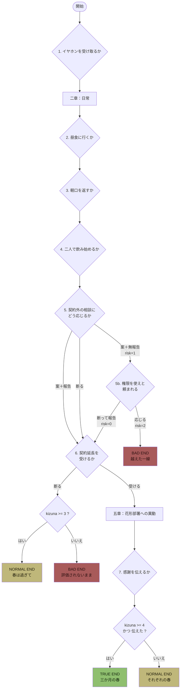

# 分岐とエンディング

原案のプロット（全4章）を骨格として残したまま、選択肢 7 箇所とエンディング 5 種を追加しています。

## 内部変数

| 変数 | 意味 | 範囲 |
|---|---|---|
| `kizuna` | 羽田春香との距離。踏み込む選択で増える | 0〜5 |
| `risk` | 契約外業務への **無報告な** 深入り度 | 0〜2 |
| `tsutaeta` | 最終日に感謝を言葉にしたか | true / false |

`kizuna` は「好感度」ではなく **清吾が自分から関わりにいった回数** です。
このゲームで問うているのは春香の気持ちではなく、清吾が殻を出たかどうかなので。

## 選択肢一覧

| # | 章 | 場面 | 選択肢 | 効果 |
|---|---|---|---|---|
| 1 | 一章 | 会議前、イヤホンを片方差し出される | 受け取る | `kizuna +1` |
| | | | 自分のPCで入ると断る | — |
| 2 | 二章 | 昼食に誘われる | 一緒に定食屋へ行く | `kizuna +1` |
| | | | 作業を理由に断る | — |
| 3 | 二章 | 「根暗って、悪くないですよ」 | 軽口で返す | `kizuna +1` |
| | | | 会釈だけして黙る | — |
| 4 | 二章 | 歓迎会。他の二人が遅れる | 二人で先に始める | `kizuna +1` |
| | | | 全員を待つ | — |
| 5 | 三章 | 契約外の技術広報の相談 | 案を出し、営業にも共有する | `kizuna +1` |
| | | | 契約外なので断る | — |
| | | | 案を出し、誰にも言わず踏み込む | `kizuna +1` / `risk +1` |
| 5b | 三章 | （`risk >= 1` のときだけ発生） 管理者権限で他部署の資料を見てほしいと頼まれる | 断り、経緯をすべて営業に報告する | `risk = 0` |
| | | | 「今回だけですよ」と応じる | `risk +1` → **打ち切り** |
| 6 | 四章 | 契約延長の打診 | 受ける（会社に残る） | → 五章へ |
| | | | 断る（予定通り退職） | → 契約満了ルートへ |
| 7 | 五章 | 最終日、エレベーターの前 | 「ありがとうございました」と伝える | `tsutaeta = true` |
| | | | 会釈だけしてエレベーターに乗る | — |

選択肢 5b は、5 で「無報告で踏み込む」を選んだ人にだけ現れます。
**一度踏み外しても、報告すれば戻れる** という構造にしています。
バッドエンドに落ちるのは、不信を理由に報告をやめ続けた場合だけです。

## エンディング到達条件

| エンディング | 条件 |
|---|---|
| **TRUE END ／ 三か月の春** | 延長を受ける ＋ `kizuna >= 4` ＋ `tsutaeta` |
| **NORMAL END ／ それぞれの春** | 延長を受ける ＋ 上記を満たさない |
| **NORMAL END ／ 春は過ぎて** | 延長を断る ＋ `kizuna >= 3` |
| **BAD END ／ 評価されないまま** | 延長を断る ＋ `kizuna <= 2` |
| **BAD END ／ 越えた一線** | `risk` が 2 に達する（三章で契約打ち切り） |

## 全体図

## 原案との対応

| 原案 | ゲームでの扱い |
|---|---|
| 1章：導入（前現場での評価、三か月限定の現場、春香との出会い） | 一章。そのまま |
| 2章：日常と気持ちの変化 | 二章。選択肢 2〜4 を追加 |
| 3章：延長の打診と、残る決意 | 四章。**受ける／断る** の選択肢に変更（原案は「残る」固定） |
| 4章：決断と不信とそれでも（別部署への異動、最後のメッセージ） | 五章 ＋ TRUE END。原案通りの結末 |
| （原案に無し） | 三章：契約外業務と報告の是非。BAD END「越えた一線」の起点 |
| （原案に無し） | BAD END「評価されないまま」。殻を出ないまま終わるルート |

原案の結末は **TRUE END** に対応します。他の 4 つは追加分です。
